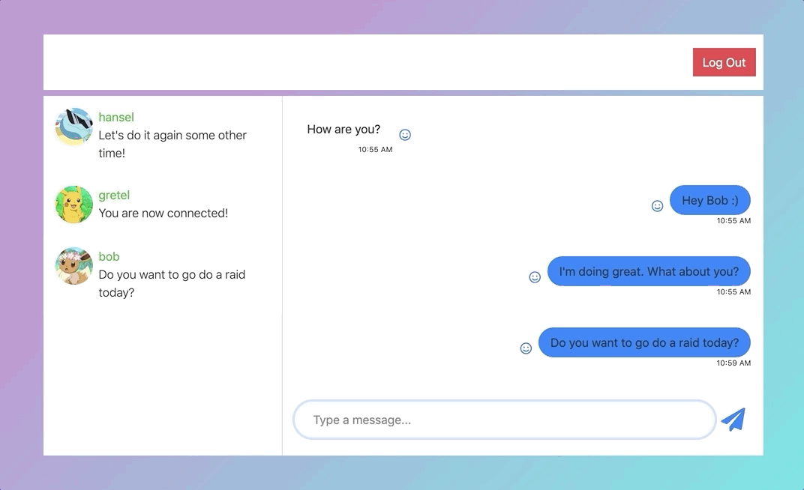

# Pogo Raid

Pogo Raid is a chat application that allows people in the Pokemon Go community to communicate easily. It was built using React, Apollo GraphQL, and PostGreSQL.

[Click here to go to the deployed application](https://salty-ocean-86043.herokuapp.com/)

* Username: sven
* Password: Password1234!

[Click here to go to the server](https://sleepy-island-47644.herokuapp.com/)

## Features
- Has user authentication.
- Responsive on tablet, mobile, and desktop devices.
- Users can message other users.
- Users can react to their messages and the messages of other users.
- Users can remove their reactions.

These instructions will get you a copy of the project up and running on your local machine for development and testing purposes. See deployment for notes on how to deploy the project on a live system.

### Prerequisites

- You have installed the latest version of [Node.js and NPM](https://nodejs.org/en/).
- You have a Windows/Linux/Mac machine.

### Installing and using

To get acclimated, follow the steps below:

1. Fork and clone this repository.
2. Open a terminal and run npm install.
3. Open a terminal and run cd client and npm install.
4. Open a terminal and run npx sequelize-cli db:migrate and then npx sequelize-cli db:seed:all.
5. Open a terminal and run npm run start to start the server and then cd client and npm run start to run the client.

## Built With

* [npm](https://www.npmjs.com/) - The package manager used to manage the various dependencies.
* [React Bootstrap](https://react-bootstrap.github.io) - The framework used to design the user interface.
* [Express](https://expressjs.com/) - The JavaScript library used to handle HTTP requests.
* [Axios](https://github.com/axios/axios) - The JavaScript library used to make HTTP requests.
* [React-Router](https://reacttraining.com/react-router/) - The standard routing library for React that allows navigation without refreshing the page.
* [Sequelize](https://sequelize.org) - The Node.js ORM used for Postgres.
* [PostgreSQL](https://www.postgresql.org) - The database used.
* [React](https://reactjs.org) - The JavaScript framework used for building the user interface.
* [Apollo GraphQL](https://www.apollographql.com) - The platform used to build, query, and manage a data graph.

## Versioning

We use [SemVer](http://semver.org/) for versioning. For the versions available, see the [tags on this repository](https://github.com/ahtae/PoGo-Raid/tags).

## Authors

* **Kristy Li** - *Initial work* - [ahtae](https://github.com/ahtae)

See also the list of [contributors](https://github.com/ahtae/PoGo-Raid/graphs/contributors) who participated in this project.

## License

This project is licensed under the MIT License - see the [LICENSE.md](https://github.com/ahtae/PoGo-Raid/blob/master/LICENSE) file for details
